# Fluxo de Implementação de Background Jobs — PostlyMail

Este documento descreve a arquitetura, o fluxo de execução, as prioridades e a especificação técnica de cada Background Job a ser implementado no **PostlyMail** utilizando **Rails 8** e **Solid Queue**.

---

## 1. Visão Geral da Arquitetura

O processamento em segundo plano é dividido em duas categorias:
1. **Event-Driven (Assíncrono sob demanda):** Jobs acionados imediatamente após uma ação de controller ou evento do sistema (`perform_later`).
2. **Recurring / Scheduled (Tarefas periódicas e crons):** Jobs agendados via `config/recurring.yml` gerenciados nativamente pelo Solid Queue.

```mermaid
flowchart TD
    subgraph Webhook_Flow["1. Fluxo de Webhooks (Asaas & Resend)"]
        W_HTTP["POST /webhooks/:provedor"] --> W_CTRL["WebhooksController"]
        W_CTRL --> W_LOG["WebhookLog.create!(status: :pendente)"]
        W_CTRL -->|200 OK imediato| W_EXT["Provedor Externo"]
        W_LOG --> W_JOB["Webhooks::ProcessarWebhookJob"]
        W_JOB --> W_SRV["Webhooks::ProcessarService"]
        W_SRV -->|provedor: asaas| W_ASAAS["Webhooks::Asaas::ProcessarService"]
        W_SRV -->|provedor: resend| W_RESEND["Webhooks::Resend::ProcessarService"]
    end

    subgraph Campaign_Flow["2. Fluxo de Campanhas e Disparos"]
        CRON_CAMP["Cron: ProcessarCampanhasAgendadasJob (1 min)"] --> CAMP_DISP["Campanhas::DispararCampanhaJob"]
        CAMP_DISP --> CAMP_SRV["Campanhas::DispararService (processar_agora: false)"]
        CAMP_SRV --> DISP_QUEUE["Disparos criados (status: na_fila)"]
        DISP_QUEUE --> DISP_JOB["Disparos::ProcessarDisparoJob"]
        DISP_JOB --> DISP_SRV["Disparos::ProcessarService"]
        DISP_JOB --> CAMP_CHECK["Campanhas::VerificarConclusaoJob"]
    end

    subgraph Billing_Flow["3. Fluxo de Cobrança e Assinaturas (SaaS)"]
        CRON_INAD["Cron: ProcessarInadimplentesJob (diário 03:00)"] --> INAD_SRV["Assinaturas::ProcessarInadimplentesService"]
        CRON_FAT["Cron: GerarFaturasRecorrentesJob (diário 04:00)"] --> FAT_SRV["AssinaturaFaturas::GerarService"]
        CRON_LEMB["Cron: EnviarLembreteFaturaJob (diário 08:00)"] --> LEMB_MAIL["Notificação / FaturaMailer"]
    end
```



---

## 2. Filas e Prioridades (Solid Queue)

| Fila | Finalidade | Nível de Prioridade | Concorrência Sugerida |
| :--- | :--- | :--- | :--- |
| `webhooks` | Processamento rápido de payloads Asaas e Resend | **Alta** | 5 threads |
| `disparos` | Envio de mensagens em massa (e-mails/notificações) | **Média** (com rate limiting) | 10 threads |
| `campanhas` | Resolução de público-alvo e orquestração de campanhas | **Média** | 2 threads |
| `billing` | Rotinas financeiras, renovação e bloqueio por inadimplência | **Média-Alta** | 2 threads |
| `mailers` | E-mails transacionais (convites, confirmações de pedido) | **Alta** | 5 threads |
| `default` | Manutenção geral e tarefas de limpeza | **Baixa** | 2 threads |

---

## 3. Roteiro de Implementação por Fases

### Fase 1: Core de Webhooks e Campanhas (Prioridade Máxima)
Implementar imediatamente, pois os services de domínio já estão prontos.

1. `Webhooks::ProcessarWebhookJob`
2. `Campanhas::ProcessarCampanhasAgendadasJob`
3. `Campanhas::DispararCampanhaJob`
4. `Disparos::ProcessarDisparoJob`
5. `Campanhas::VerificarConclusaoJob`

### Fase 2: Gestão Financeira e Assinaturas (SaaS Multi-tenant)
Automatizar o ciclo de faturas e bloqueio de inadimplentes.

6. `Assinaturas::ProcessarInadimplentesJob`
7. `Assinaturas::GerarFaturasRecorrentesJob`
8. `Assinaturas::EnviarLembreteFaturaJob`
9. `Webhooks::ReprocessarFalhasJob`

### Fase 3: Gestão de Acessos e Operação de Vendas
Habilitar convites de equipe e notificações de pedidos.

10. `Convites::EnviarEmailConviteJob`
11. `Convites::LimparExpiradosJob`
12. `Vendas::EnviarConfirmacaoPedidoJob`
13. `Estoques::VerificarEstoqueBaixoJob`

---

## 4. Especificação Técnica dos Jobs

---

### JOB 1: `Webhooks::ProcessarWebhookJob`
* **Arquivo:** `app/jobs/webhooks/processar_webhook_job.rb`
* **Fila:** `webhooks`
* **Gatilho:** Invocado pelo `WebhooksController` logo após salvar o `WebhookLog` com status `:pendente`.
* **Idempotência:** Garantida pelo `Webhooks::ProcessarService`.

```ruby
# frozen_string_literal: true

module Webhooks
  class ProcessarWebhookJob < ApplicationJob
    queue_as :webhooks

    retry_on StandardError, wait: :exponentially_longer, attempts: 5

    def perform(webhook_log_id)
      log = WebhookLog.find_by(id: webhook_log_id)
      return if log.nil? || log.processado? || log.duplicado_ignorado?

      resultado = Webhooks::ProcessarService.call(webhook_log: log)

      raise StandardError, resultado.error if resultado.failure?
    end
  end
end
```

---

### JOB 2: `Campanhas::ProcessarCampanhasAgendadasJob`
* **Arquivo:** `app/jobs/campanhas/processar_campanhas_agendadas_job.rb`
* **Fila:** `campanhas`
* **Gatilho:** Recorrente (`config/recurring.yml`, todo minuto).
* **Responsabilidade:** Varrer campanhas com `status: :agendada` onde `data_envio <= Time.current`.

```ruby
# frozen_string_literal: true

module Campanhas
  class ProcessarCampanhasAgendadasJob < ApplicationJob
    queue_as :campanhas

    def perform
      Campanha.agendada.where("data_envio <= ?", Time.current).find_each do |campanha|
        Campanhas::DispararCampanhaJob.perform_later(campanha.id)
      end
    end
  end
end
```

---

### JOB 3: `Campanhas::DispararCampanhaJob`
* **Arquivo:** `app/jobs/campanhas/disparar_campanha_job.rb`
* **Fila:** `campanhas`
* **Gatilho:** Acionado manualmente via painel web ou pelo `ProcessarCampanhasAgendadasJob`.
* **Responsabilidade:** Chama `Campanhas::DispararService` com `processar_agora: false` para gerar os registros de `Disparo` no banco em estado `:na_fila`, e enfileira cada disparo individualmente.

```ruby
# frozen_string_literal: true

module Campanhas
  class DispararCampanhaJob < ApplicationJob
    queue_as :campanhas

    def perform(campanha_id, forcar: false)
      campanha = Campanha.find_by(id: campanha_id)
      return if campanha.nil? || (campanha.concluida? && !forcar)

      resultado = Campanhas::DispararService.call(
        campanha: campanha,
        processar_agora: false,
        forcar: forcar
      )

      return unless resultado.success?

      # Enfileira os disparos em lote para a fila de envio
      campanha.disparos.na_fila.find_each do |disparo|
        Disparos::ProcessarDisparoJob.perform_later(disparo.id)
      end
    end
  end
end
```

---

### JOB 4: `Disparos::ProcessarDisparoJob`
* **Arquivo:** `app/jobs/disparos/processar_disparo_job.rb`
* **Fila:** `disparos`
* **Gatilho:** Enfileirado pelo `DispararCampanhaJob`.
* **Responsabilidade:** Executa a entrega unitária via `Disparos::ProcessarService` (integrando com Resend para e-mail ou WhatsApp). Ao finalizar, verifica se a campanha completou todos os disparos.

```ruby
# frozen_string_literal: true

module Disparos
  class ProcessarDisparoJob < ApplicationJob
    queue_as :disparos

    retry_on StandardError, wait: :exponentially_longer, attempts: 3

    def perform(disparo_id)
      disparo = Disparo.find_by(id: disparo_id)
      return if disparo.nil? || disparo.enviado? || disparo.entregue?

      resultado = Disparos::ProcessarService.call(disparo: disparo)

      if resultado.success?
        Campanhas::VerificarConclusaoJob.perform_later(disparo.campanha_id)
      else
        raise StandardError, resultado.error
      end
    end
  end
end
```

---

### JOB 5: `Campanhas::VerificarConclusaoJob`
* **Arquivo:** `app/jobs/campanhas/verificar_conclusao_job.rb`
* **Fila:** `campanhas`
* **Gatilho:** Chamado após finalização de disparos individuais.
* **Responsabilidade:** Confere se não restam disparos com status `:na_fila` para a campanha. Em caso positivo, atualiza a campanha para `:concluida`.

```ruby
# frozen_string_literal: true

module Campanhas
  class VerificarConclusaoJob < ApplicationJob
    queue_as :campanhas

    def perform(campanha_id)
      campanha = Campanha.find_by(id: campanha_id)
      return if campanha.nil? || campanha.concluida?

      unless campanha.disparos.na_fila.exists?
        campanha.update!(status: :concluida, data_envio: Time.current)
      end
    end
  end
end
```

---

### JOB 6: `Assinaturas::ProcessarInadimplentesJob`
* **Arquivo:** `app/jobs/assinaturas/processar_inadimplentes_job.rb`
* **Fila:** `billing`
* **Gatilho:** Recorrente diário às 03:00.
* **Responsabilidade:** Executa `Assinaturas::ProcessarInadimplentesService` para varrer todas as empresas, marcar atrasadas, suspender assinaturas e bloquear empresas inadimplentes.

```ruby
# frozen_string_literal: true

module Assinaturas
  class ProcessarInadimplentesJob < ApplicationJob
    queue_as :billing

    def perform
      Assinaturas::ProcessarInadimplentesService.call
    end
  end
end
```

---

### JOB 7: `Assinaturas::GerarFaturasRecorrentesJob`
* **Arquivo:** `app/jobs/assinaturas/gerar_faturas_recorrentes_job.rb`
* **Fila:** `billing`
* **Gatilho:** Recorrente diário às 04:00.
* **Responsabilidade:** Identifica assinaturas ativas cuja vigência (`data_fim`) expira nos próximos 7 dias e emite a fatura do próximo ciclo via `AssinaturaFaturas::GerarService`.

```ruby
# frozen_string_literal: true

module Assinaturas
  class GerarFaturasRecorrentesJob < ApplicationJob
    queue_as :billing

    def perform(dias_antecedencia = 7)
      limite = Date.current + dias_antecedencia.days

      Assinatura.ativas.where("data_fim <= ?", limite).find_each do |assinatura|
        proximo_vencimento = assinatura.data_fim || Date.current

        # Não duplicar fatura se já existir fatura pendente para o vencimento
        next if assinatura.faturas.pendentes.where(data_vencimento: proximo_vencimento).exists?

        AssinaturaFaturas::GerarService.call(
          assinatura: assinatura,
          valor: assinatura.valor,
          data_vencimento: proximo_vencimento
        )
      end
    end
  end
end
```

---

### JOB 8: `Convites::EnviarEmailConviteJob`
* **Arquivo:** `app/jobs/convites/enviar_email_convite_job.rb`
* **Fila:** `mailers`
* **Gatilho:** Invocado após criação/reenvio de convite via `Convites::SalvarService`.

```ruby
# frozen_string_literal: true

module Convites
  class EnviarEmailConviteJob < ApplicationJob
    queue_as :mailers

    retry_on StandardError, wait: :exponentially_longer, attempts: 3

    def perform(convite_id)
      convite = Convite.find_by(id: convite_id)
      return if convite.nil? || !convite.pendente?

      # ConviteMailer.notificar_convite(convite).deliver_now
    end
  end
end
```

---

### JOB 9: `Convites::LimparExpiradosJob`
* **Arquivo:** `app/jobs/convites/limpar_expirados_job.rb`
* **Fila:** `default`
* **Gatilho:** Recorrente diário às 02:00.
* **Responsabilidade:** Cancela convites expirados há mais de 30 dias para liberação de slots e limpeza de banco.

```ruby
# frozen_string_literal: true

module Convites
  class LimparExpiradosJob < ApplicationJob
    queue_as :default

    def perform
      Convite.expirados.where("expira_em <= ?", 30.days.ago).update_all(cancelado_em: Time.current)
    end
  end
end
```

---

### JOB 10: `Webhooks::ReprocessarFalhasJob`
* **Arquivo:** `app/jobs/webhooks/reprocessar_falhas_job.rb`
* **Fila:** `webhooks`
* **Gatilho:** Recorrente a cada 1 hora.
* **Responsabilidade:** Reprocessa logs com status `:falhou` criados nas últimas 24 horas.

```ruby
# frozen_string_literal: true

module Webhooks
  class ReprocessarFalhasJob < ApplicationJob
    queue_as :webhooks

    def perform
      WebhookLog.where(status: :falhou)
                .where("created_at >= ?", 24.hours.ago)
                .find_each do |log|
        Webhooks::ProcessarService.call(webhook_log: log, forcar: true)
      end
    end
  end
end
```

---

## 5. Configuração Final do `config/recurring.yml`

Atualização recomendada para o arquivo [`config/recurring.yml`](file:///home/carlim/fun/postlymail/config/recurring.yml):

```yaml
production:
  clear_solid_queue_finished_jobs:
    command: "SolidQueue::Job.clear_finished_in_batches(sleep_between_batches: 0.3)"
    schedule: every hour at minute 12

  processar_campanhas_agendadas:
    class: Campanhas::ProcessarCampanhasAgendadasJob
    queue: campanhas
    schedule: every minute

  processar_assinaturas_inadimplentes:
    class: Assinaturas::ProcessarInadimplentesJob
    queue: billing
    schedule: at 3am every day

  gerar_faturas_recorrentes:
    class: Assinaturas::GerarFaturasRecorrentesJob
    queue: billing
    schedule: at 4am every day

  limpar_convites_expirados:
    class: Convites::LimparExpiradosJob
    queue: default
    schedule: at 2am every day

  reprocessar_webhooks_com_falha:
    class: Webhooks::ReprocessarFalhasJob
    queue: webhooks
    schedule: every hour
```

---

## 6. Comandos e Monitoramento (Solid Queue)

Em desenvolvimento e produção:
- **Iniciar workers:** `bin/rails solid_queue:start`
- **Painel de métricas:** Disponível via Mission Control Jobs (`gem "mission_control-jobs"`).
- **Inspecionar falhas:** `SolidQueue::FailedExecution.all`
