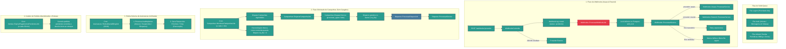

# Fluxo de Implementação de Background Jobs — PostlyMail (Arquitetura Consolidada)

Este documento descreve a arquitetura, filas e especificações técnicas de Background Jobs no **PostlyMail** em **Rails 8** com **Solid Queue**, consolidada e otimizada para escalabilidade no PostgreSQL.

---

## 1. Visão Geral da Arquitetura Enxuta

O sistema consolida a execução em **3 filas essenciais** com finalidades bem demarcadas, evitando sobrecarga de conexões com o banco e garantindo isolamento total de prioridade:


```mermaid
flowchart TD
    subgraph Filas_Solid_Queue["Filas do Solid Queue"]
        Q_URGENT["Fila: urgent (Prioridade Alta)"]
        Q_BULK["Fila: bulk (Volume / Mensageria em Massa)"]
        Q_DEFAULT["Fila: default (Tarefas Periódicas, Billing e Crons)"]
    end

    subgraph Webhook_Flow["1. Fluxo de Webhooks (Asaas & Resend)"]
        W_HTTP["POST /webhooks/:provedor"] --> W_CTRL["WebhooksController"]
        W_CTRL --> W_LOG["WebhookLog.create!(status: :pendente)"]
        W_CTRL -->|200 OK imediato| W_EXT["Provedor Externo"]
        W_LOG --> W_JOB["Webhooks::ProcessarWebhookJob"]:::urgent
        W_JOB --> W_LOCK["Lock Atômico no Postgres: with_lock"]
        W_LOCK --> W_SRV["Webhooks::ProcessarService"]
        W_SRV -->|provedor: asaas| W_ASAAS["Webhooks::Asaas::ProcessarService"]
        W_SRV -->|provedor: resend| W_RESEND["Webhooks::Resend::ProcessarService"]
        W_SRV -->|Erro transitório| W_RETRY["Retry exponencial"]
        W_SRV -->|Erro definitivo| W_FAIL["Marca :falhou e libera fila urgent"]
    end

    subgraph Campaign_Flow["2. Fluxo Otimizado de Campanhas (Sem Gargalos)"]
        CRON_CAMP["Cron: Campanhas::MonitorarCampanhasJob (a cada 1 min)"]:::default --> CAMP_AGEND["Dispara Campanhas Agendadas"]
        CRON_CAMP --> CAMP_RECONC["Reconciliação: Marca como concluída quando Disparo.na_fila = 0"]
        CAMP_AGEND --> CAMP_DISP["Campanhas::DispararCampanhaJob"]:::default
        CAMP_DISP --> CAMP_SRV["Campanhas::DispararService (processar_agora: false)"]
        CAMP_SRV --> DISP_QUEUE["Disparos gerados no banco (:na_fila)"]
        DISP_QUEUE --> DISP_JOB["Disparos::ProcessarDisparoJob"]:::bulk
        DISP_JOB --> DISP_SRV["Disparos::ProcessarService"]
    end

    subgraph Billing_Flow["3. Rotina Noturna de Assinaturas (Unificada)"]
        CRON_BILL["Cron: Assinaturas::RotinaDiariaBillingJob (03:00)"]:::default --> BILL_INAD["1. Processa Inadimplentes (Atrasos / Suspensões / Bloqueios)"]
        BILL_INAD --> BILL_FAT["2. Gera Faturas dos Próximos 7 Dias (Renovação)"]
    end

    subgraph Sales_Flow["4. Gestão de Pedidos Abandonados e Estoque"]
        CRON_SALES["Cron: Vendas::ExpirarPagamentosPendentesJob (a cada 30 min)"]:::default --> EXPIRAR["Cancela pedidos pendentes vencidos e devolve itens ao estoque"]
    end

    classDef urgent fill:#e63946,stroke:#b7094c,stroke-width:2px,color:#fff;
    classDef bulk fill:#457b9d,stroke:#1d3557,stroke-width:2px,color:#fff;
    classDef default fill:#2a9d8f,stroke:#264653,stroke-width:2px,color:#fff;
```

---

## 2. Estrutura de Filas e Concorrência

| Fila | Finalidade | Nível de Prioridade | Tratamento de Concorrência |
| :--- | :--- | :--- | :--- |
| **`urgent`** | Webhooks (Asaas, Resend) e e-mails transacionais críticos | **Máxima** | Execução imediata com latência mínima (< 1s) |
| **`bulk`** | Disparos de campanhas em massa (e-mails / WhatsApp) | **Média** | Concorrência controlada para respeitar limites de taxa (rate limiting) do Resend |
| **`default`** | Tarefas periódicas, crons noturnos de billing, expiração de pedidos | **Padrão** | Execução sequencial ordenada e manutenção |

---

## 3. Principais Decisões de Arquitetura

1. **Idempotência Atômica e Tratamento de Erros no Webhook (`ProcessarWebhookJob`):**
   - Lock pessimista a nível de linha no PostgreSQL via `with_lock` (`SELECT FOR UPDATE`).
   - Diferenciação estrita de falhas:
     - **Transitórias (Infraestrutura/Rede):** levantam `Webhooks::TransientError` para retry exponencial com Solid Queue.
     - **Definitivas (Payload/Negócio):** logam aviso e encerram pacificamente sem disparar exceção, mantendo o status `:falhou` no banco e **desobstruindo a fila `urgent` instantaneamente**.
2. **Eliminação do `VerificarConclusaoJob` Reativo:**
   - A conclusão é gerida por reconciliação leve a cada minuto pelo `Campanhas::MonitorarCampanhasJob`, que busca campanhas com status `:enviando` sem disparos pendentes em `:na_fila` e as conclui em uma única query.
3. **Unificação da Rotina Diária de Billing:**
   - Um único job (`Assinaturas::RotinaDiariaBillingJob`) às 03:00 executa sequencialmente o processamento de inadimplência e a emissão das faturas a vencer nos próximos 7 dias.
4. **Descentralização dos Convites:**
   - Convites expirados são tratados dinamicamente via scopes do ActiveRecord (`convites.pendentes`, `convites.expirados`), dispensando cron de expurgo.
5. **Proteção de Estoque via Expiração de Pedidos:**
   - Inclusão do job `Vendas::ExpirarPagamentosPendentesJob` para liberar itens reservados em pedidos que não foram pagos dentro do prazo de tolerância.

---

## 4. Especificação dos Jobs Implementados

### 1. `Webhooks::ProcessarWebhookJob`
* **Arquivo:** `app/jobs/webhooks/processar_webhook_job.rb`
* **Fila:** `urgent`
* **Gatilho:** Invocado imediatamente pelo controller de webhook após gravação do `WebhookLog`.
* **Comportamento:** Executa `with_lock` para garantir atomicidade no PostgreSQL, chama `Webhooks::ProcessarService` e só dispara retries em falhas transitórias.

```ruby
# frozen_string_literal: true

module Webhooks
  class TransientError < StandardError; end

  class ProcessarWebhookJob < ApplicationJob
    queue_as :urgent

    retry_on ActiveRecord::Deadlocked, wait: 2.seconds, attempts: 3
    retry_on Webhooks::TransientError, wait: :exponentially_longer, attempts: 5
    discard_on ActiveJob::DeserializationError

    ERROS_TRANSITORIOS = %i[
      network_timeout
      connection_error
      gateway_unavailable
      rate_limit_exceeded
      database_locked
      service_unavailable
    ].freeze

    def perform(webhook_log_id)
      log = WebhookLog.find_by(id: webhook_log_id)
      return if log.nil?

      log.with_lock do
        return if log.processado? || log.duplicado_ignorado?

        resultado = Webhooks::ProcessarService.call(webhook_log: log)

        if resultado.failure?
          if transitivo?(resultado.error_code)
            raise TransientError, "Erro transitório no webhook ##{webhook_log_id}: #{resultado.error}"
          else
            Rails.logger.warn("[Webhooks] Falha definitiva no WebhookLog ##{webhook_log_id}: #{resultado.error}")
          end
        end
      end
    end

    private

    def transitivo?(error_code)
      ERROS_TRANSITORIOS.include?(error_code.to_s.to_sym)
    end
  end
end
```

### 2. `Campanhas::MonitorarCampanhasJob`
* **Arquivo:** `app/jobs/campanhas/monitorar_campanhas_job.rb`
* **Fila:** `default`
* **Gatilho:** Recorrente (a cada 1 minuto via `config/recurring.yml`).
* **Comportamento:**
  1. **Disparo de Agendadas:** Identifica campanhas agendadas com `data_envio <= Time.current` e enfileira `Campanhas::DispararCampanhaJob`.
  2. **Reconciliação Anti-Join de Alto Desempenho:** Localiza campanhas em `:enviando` utilizando `NOT EXISTS` correlacionado sobre `disparos` (aproveitando o índice `(campanha_id, status)` em \(O(1)\), sem lentidão de subqueries `NOT IN`).
  3. **Proteção Contra Condição de Corrida:** Aplica margem de estabilidade temporal (`updated_at <= 2.minutes.ago`), impedindo que campanhas recém-iniciadas sejam indevidamente concluídas antes da geração completa dos seus disparos.
  4. **Preservação Histórica:** Preserva o `data_envio` original da campanha (`data_envio.presence || Time.current`), sem sobrescrever o timestamp inicial de disparo.

### 3. `Campanhas::DispararCampanhaJob`
* **Arquivo:** `app/jobs/campanhas/disparar_campanha_job.rb`
* **Fila:** `bulk`
* **Gatilho:** Acionado manualmente pelo painel ou pelo cron `Campanhas::MonitorarCampanhasJob`.
* **Comportamento:**
  - **Proteção Atômica contra Cliques Duplos:** Utiliza `campanha.with_lock` (`SELECT FOR UPDATE`) para impedir que cliques repetidos ou workers concorrentes processem a mesma campanha em paralelo. Se a campanha já estiver `:enviando` ou `:concluida` (sem flag `forcar`), o job aborta imediatamente.
  - **Transição de Campanhas sem Contatos:** Caso o segmento resulte em zero contatos elegíveis no público-alvo, a campanha transiciona imediatamente para `:concluida` com `data_envio = Time.current`, sem deixar o status pendente nem enfileirar jobs vazios.
  - **Enfileiramento Otimizado em Lote (`ActiveJob.perform_all_later`):** Em vez de iterar individualmente disparando `perform_later` unitários, fatia os disparos em lotes de até 1.000 registros (`find_in_batches`) e realiza o enfileiramento em lote via `ActiveJob.perform_all_later`, reduzindo drasticamente as operações de I/O na tabela `solid_queue_jobs`.

### 4. `Disparos::ProcessarDisparoJob`
* **Arquivo:** `app/jobs/disparos/processar_disparo_job.rb`
* **Fila:** `bulk`
* **Gatilho:** Enfileirado pelo `DispararCampanhaJob`.
* **Comportamento:**
  - **Idempotência Atômica:** Garante exclusividade de processamento com `with_lock` (`SELECT FOR UPDATE`), ignorando mensagens já enviadas, entregues, rejeitadas ou canceladas.
  - **Tratamento de Falhas (Transitórias vs Definitivas):**
    - *Transitórias (`network_timeout`, `rate_limit_exceeded`, `gateway_unavailable`):* Levantam `Disparos::TransientError` para retry exponencial com Solid Queue.
    - *Definitivas (destinatário malformado, hard bounce):* Logam warning e concluem sem exceção, não queimando retries nem gerando custos desnecessários em APIs externas.
  - **Conclusão em Tempo Real da Campanha:** Quando o último disparo da fila é processado, faz o lock na `Campanha` pai e a marca como `:concluida` com `data_envio = Time.current`, sem necessidade de enfileirar jobs redundantes de verificação.

### 5. `Assinaturas::RotinaDiariaBillingJob`
* **Arquivo:** `app/jobs/assinaturas/rotina_diaria_billing_job.rb`
* **Fila:** `default`
* **Gatilho:** Recorrente diário às 03:00.
* **Gatilho:** Recorrente diário às 03:00 via `config/recurring.yml`.
* **Comportamento:**
  1. Executa `Assinaturas::ProcessarInadimplentesService` para atualizar atrasos, suspensões e bloqueios.
  2. Varre assinaturas ativas com `data_fim <= Date.current + 7.days` e gera a próxima fatura via `AssinaturaFaturas::GerarService` caso ainda não exista fatura pendente.
  - **Isolamento de Falhas por Assinatura:** Cada assinatura é faturada dentro de um bloco de resguardo com `rescue StandardError`. Caso ocorra uma falha com uma empresa específica (ex.: erro no gateway Asaas ou validação), o erro é registrado no log e a rotina prossegue normalmente com as demais assinaturas do lote. O mesmo isolamento protege a rotina de inadimplência.
  - **Prevenção de Duplicidades em Pagamentos Antecipados:** Verifica `faturas.where.not(status: :cancelada).where(data_vencimento: proxima_data_vencimento)`. Se o cliente já tiver uma fatura `:pendente` ou `:paga` (ciclo pago antecipadamente), a geração é ignorada.
  - **Proteção Concorrente via `with_lock`:** Adquire lock pessimista (`SELECT FOR UPDATE`) na `Assinatura` durante o faturamento, impedindo a geração duplicada de faturas caso o job seja executado concorrentemente (ex.: disparo manual e cron automático simultâneos).

### 6. `Vendas::ExpirarPagamentosPendentesJob`
* **Arquivo:** `app/jobs/vendas/expirar_pagamentos_pendentes_job.rb`
* **Fila:** `default`
* **Gatilho:** Recorrente a cada 30 minutos.
* **Comportamento:**
  - **Prazos Diferenciados por Método de Pagamento:**
    - *Checkout Abandonado (sem pagamento criado):* Expira após 2 horas.
    - *Pix:* Expira após 24 horas ou prazo de expiração do QR Code.
    - *Boleto Bancário:* Respeita a data de vencimento (`data_vencimento`) acrescida de margem legal de compensação bancária (+3 dias úteis), impedindo o cancelamento indevido de pedidos com boletos pagos no banco.
  - **Proteção Multimétodos:** Se um pedido tiver múltiplos pagamentos associados, só é cancelado se **todos** os pagamentos estiverem estritamente expirados.
  - Ao expirar, invoca `Vendas::CancelarVendaService` liberando os itens reservados de volta ao estoque.

### 7. `Webhooks::ReprocessarFalhasJob`
* **Arquivo:** `app/jobs/webhooks/reprocessar_falhas_job.rb`
* **Fila:** `default`
* **Gatilho:** Recorrente a cada 1 hora.
* **Comportamento:**
  - Localiza logs com status `:falhou` nas últimas 24h.
  - **Circuit-Breaker Anti-Loop:** Limita a no máximo 3 tentativas registradas no `payload["_tentativas_reprocessamento"]`. Ao atingir o limite, marca como descarte definitivo.
  - **Filtro de Erros Irrecuperáveis:** Ignora automaticamente payloads vazios ou dados corrompidos.
  - **Isolamento de Lote:** Cada registro é processado dentro de um bloco com tratamento de exceção (`rescue StandardError`), garantindo que uma falha isolada nunca trave os outros registros do lote.

---

## 5. Mapeamento no `config/recurring.yml`

```yaml
production:
  clear_solid_queue_finished_jobs:
    command: "SolidQueue::Job.clear_finished_in_batches(sleep_between_batches: 0.3)"
    schedule: every hour at minute 12

  monitorar_campanhas:
    class: Campanhas::MonitorarCampanhasJob
    queue: default
    schedule: every minute

  rotina_diaria_billing:
    class: Assinaturas::RotinaDiariaBillingJob
    queue: default
    schedule: at 3am every day

  expirar_pagamentos_pendentes:
    class: Vendas::ExpirarPagamentosPendentesJob
    queue: default
    schedule: every 30 minutes

  reprocessar_webhooks_falhos:
    class: Webhooks::ReprocessarFalhasJob
    queue: default
    schedule: every hour
```
